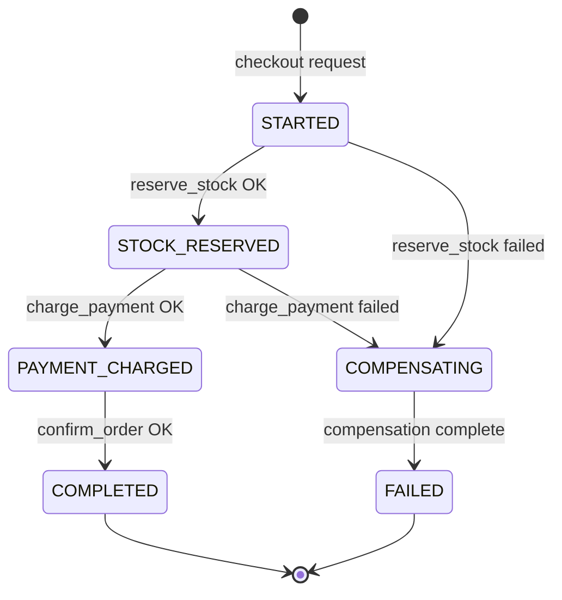
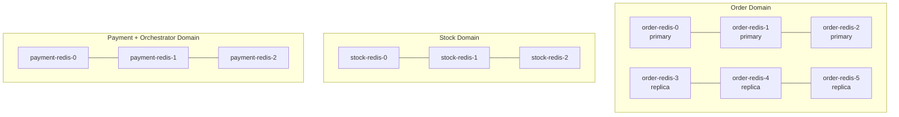

# Phase 7: Validation and Delivery - Research

**Researched:** 2026-03-01
**Domain:** Integration testing, benchmark validation, kill-test consistency, architecture documentation
**Confidence:** HIGH

<user_constraints>
## User Constraints (from CONTEXT.md)

### Locked Decisions

**Architecture document structure:**
- Organized by system layer: Communication (gRPC) → Orchestration (SAGA) → Events (Streams) → Resilience (fault tolerance) → Infrastructure (Redis Cluster, K8s)
- Audience: team members preparing for project presentation — each section must explain what was chosen, alternatives considered, and why the decision was made
- Decision-focused depth: concise (1-2 pages per topic), covering rationale and tradeoffs rather than implementation details
- Mermaid diagrams for visual architecture representation (sequence diagrams, flowcharts, topology)

**Kill-test scenarios:**
- Kill each service individually (Order, Stock, Payment, Orchestrator) during active load
- Eventually consistent expectation: after recovery + 30-second fixed timeout, balances must converge to correct values
- Automated shell/Python scripts that kill containers, wait for recovery, then assert consistency
- Scripts should be repeatable and CI-friendly

**Benchmark strategy:**
- Benchmark source: https://github.com/delftdata/wdm-project-benchmark (needs to be cloned)
- Run the wdm-project-benchmark unmodified against the system
- Fix any failures discovered (correctness vs performance triage at Claude's discretion)
- Integration test and benchmark sequencing at Claude's discretion

**Contributions file:**
- Written manually by the team — excluded from automated phase work
- Only create an empty placeholder or skip entirely

### Claude's Discretion
- Triage order for benchmark failures (correctness vs performance)
- Whether integration tests gate benchmark runs or run independently
- Specific kill-test timing (which SAGA states to target)
- Exact Mermaid diagram types per architecture section

### Deferred Ideas (OUT OF SCOPE)

None — discussion stayed within phase scope
</user_constraints>

<phase_requirements>
## Phase Requirements

| ID | Description | Research Support |
|----|-------------|-----------------|
| DOCS-01 | Architecture design document written in markdown for final presentation | Mermaid diagram patterns, layer-by-layer document structure, decision-rationale framing |
| DOCS-02 | Architecture doc covers: SAGA pattern, gRPC design, Redis Cluster topology, Kubernetes scaling, event-driven design, fault tolerance strategy | All six topics are covered in accumulated STATE.md decisions — each has source code + deployment artifacts to draw from |
| DOCS-03 | contributions.txt file at repo root with team member contributions | Placeholder only; manual content by team |
| TEST-01 | Existing integration tests pass against new architecture | `pytest tests/ -x -v` (existing suite: test_grpc_integration.py, test_saga.py, test_fault_tolerance.py, test_events.py) running in-process against real Redis + gRPC test servers |
| TEST-02 | System passes the provided wdm-project-benchmark without modifications | Clone https://github.com/delftdata/wdm-project-benchmark; configure urls.json to http://localhost:8000 (the gateway); run run_consistency_test.py against live Docker Compose cluster |
| TEST-03 | Consistency verified after kill-container recovery scenarios | Automated Python/shell scripts: bring up cluster, run load, kill target container, wait 30s for recovery, assert credit totals and stock counts are consistent |
</phase_requirements>

---

## Summary

Phase 7 is an integration and delivery phase — no new service logic is introduced. The work falls into three parallel tracks: (1) validate the system against an external benchmark and existing integration tests, (2) write kill-test automation scripts that kill each service under active load and then assert consistency, and (3) produce the architecture document for team presentation.

The wdm-project-benchmark is a Python script suite that populates the system with 1 item (100 stock, cost 1 credit) and 1000 users (1 credit each), then fires 1000 concurrent checkout requests. It asserts that exactly 100 succeed (all stock consumed), the item stock reaches 0, and the sum of user credits equals the starting total minus 100. The benchmark talks exclusively to the existing HTTP gateway at `localhost:8000` — no endpoint modifications are required, since the system already exposes exactly the URL patterns the benchmark expects. The benchmark is cloned fresh; the only configuration is editing `urls.json` to point to the gateway.

The kill-test automation needs to: start the cluster (`make dev-cluster`), populate test data, run concurrent checkouts, kill a target container mid-flight via `docker compose stop <service>`, wait for recovery, then query Redis or the HTTP API to assert balance consistency. Docker Compose already has `restart: always` on all containers (set in Phase 4), so recovery happens automatically. The 30-second timeout after kill is sufficient for the orchestrator's startup SAGA recovery scan (which runs on startup in `recovery.py`, blocking serve until stale SAGAs resolve). Each scenario should be an independent script (or parameterized test) that can be run without manual intervention.

**Primary recommendation:** Run tests and benchmark against the live Docker Compose cluster (not in-process mocks) for Phase 7 validation; the existing `pytest tests/` suite can continue running in-process as a quick sanity gate before the live cluster tests.

---

## Standard Stack

### Core

| Library / Tool | Version | Purpose | Why Standard |
|---|---|---|---|
| pytest + pytest-asyncio | installed (pytest.ini present) | Unit/integration test runner for in-process tests | Already the project test framework; asyncio_mode=auto configured |
| Docker Compose | Bitnami redis-cluster:8.0 | Spin up full local cluster for live validation | Already in docker-compose.yml with `make dev-cluster` target |
| Python requests / aiohttp | (stdlib-compatible) | HTTP calls in kill-test scripts | wdm-project-benchmark uses aiohttp; kill-test scripts can use requests for simplicity |
| Mermaid | (rendered by GitHub markdown) | Architecture diagrams in the design doc | Supported natively in GitHub Markdown; no extra tooling needed |

### Supporting

| Library / Tool | Version | Purpose | When to Use |
|---|---|---|---|
| docker CLI | system | Kill/stop containers in kill-test scripts | `docker compose stop <svc>` and `docker compose start <svc>` |
| redis-cli | system | Direct Redis inspection for consistency assertions | Verify key counts if HTTP API is insufficient |
| locust | (in benchmark requirements.txt) | Stress-test mode of the benchmark | Stress-test only; consistency test doesn't use Locust directly |
| Python subprocess | stdlib | Invoke docker commands from kill-test Python script | CI-friendly: single Python script can manage entire kill-test lifecycle |

### Alternatives Considered

| Instead of | Could Use | Tradeoff |
|---|---|---|
| docker compose stop | docker kill | `stop` sends SIGTERM → graceful shutdown; `kill` sends SIGKILL → hard kill. Hard kills are more realistic for crash scenarios, but `docker compose kill` works too. |
| Python kill-test script | Shell (bash) script | Python is more portable and easier to add assertions; shell is simpler for orchestration. Python preferred given the team already has test infrastructure in Python. |
| Mermaid in markdown | draw.io / Lucidchart | Mermaid renders in GitHub, requires no external tools, and is text-based (version-controllable). Preferred for this workflow. |

---

## Architecture Patterns

### Recommended Document Structure (DOCS-01, DOCS-02)

```
docs/architecture.md
├── 1. System Overview (brief topology diagram)
├── 2. Communication: gRPC Design
│     - What: proto definitions, dual-server pattern
│     - Alternatives: HTTP/REST, message queue
│     - Why: typed, low-latency, idempotency_key field
├── 3. Orchestration: SAGA Pattern
│     - What: state machine (STARTED → COMPLETED/FAILED), compensating transactions
│     - Alternatives: choreography-only, 2PC
│     - Why: crash-recoverable, explicit state, forward-first replay
├── 4. Event-Driven: Redis Streams
│     - What: consumer groups, XREADGROUP + XACK + XAUTOCLAIM
│     - Alternatives: Kafka, RabbitMQ
│     - Why: same Redis infrastructure, fits 20-CPU budget, built-in consumer groups
├── 5. Fault Tolerance Strategy
│     - What: circuit breaker, startup SAGA recovery, restart:always
│     - Alternatives: saga without recovery, 2PC
│     - Why: orchestrator ownership, idempotent replay, no split-brain
└── 6. Infrastructure: Redis Cluster + Kubernetes
      - What: 3 per-domain Redis Clusters, HPA, Helm charts
      - Alternatives: single Redis, standalone Redis
      - Why: HA, domain isolation, automatic failover
```

### Mermaid Diagram Types per Section

| Section | Diagram Type | What to Show |
|---|---|---|
| System Overview | `graph LR` flowchart | Gateway → Order/Stock/Payment/Orchestrator → Redis Clusters |
| gRPC Design | `sequenceDiagram` | Order → Orchestrator gRPC → Stock gRPC → Payment gRPC → response |
| SAGA State Machine | `stateDiagram-v2` | States: STARTED → STOCK_RESERVED → PAYMENT_CHARGED → COMPLETED, plus COMPENSATING/FAILED paths |
| Redis Cluster Topology | `graph TD` | Per-domain clusters, 6-node (3 primary + 3 replica), slot ranges |
| Event Stream Flow | `sequenceDiagram` | Orchestrator publishes → Stream → Compensation consumer processes → ACK |
| K8s Scaling | `graph LR` | HPA → Deployments, request count trigger |

### Kill-Test Script Pattern

```python
#!/usr/bin/env python3
"""
kill_test.py: Kill <service> during active checkout load, assert consistency after recovery.

Usage: python kill_test.py --service stock-service
"""
import argparse, subprocess, asyncio, time, requests

GATEWAY = "http://localhost:8000"
RECOVERY_WAIT = 30  # seconds — orchestrator startup recovery scan completes in this window

def run(cmd): subprocess.run(cmd, shell=True, check=True)

def populate():
    """Seed 1 item (100 stock, price=1) and 1000 users (credit=1 each)."""
    # POST /stock/item/create/1, POST /stock/add/{id}/100
    # POST /payment/create_user x1000, POST /payment/add_funds/{id}/1

def fire_concurrent_checkouts(n=200):
    """Fire n checkout requests concurrently via asyncio."""
    # POST /orders/create/{user_id}
    # POST /orders/addItem/{order_id}/{item_id}/1
    # POST /orders/checkout/{order_id} — gather all

def kill_and_recover(service: str):
    run(f"docker compose stop {service}")
    time.sleep(2)                      # ensure in-flight requests see the outage
    run(f"docker compose start {service}")
    time.sleep(RECOVERY_WAIT)          # wait for startup recovery scan + gRPC reconnect

def assert_consistency(initial_stock: int, initial_credits: int):
    """Assert stock + credits account for exactly the checkouts that succeeded."""
    # GET /stock/find/{item_id} → remaining_stock
    # GET /payment/find_user/{uid} for all users → sum credits
    # Assert: initial_credits - sum(current_credits) == initial_stock - remaining_stock
    # i.e., every credit deducted corresponds to a stock decrement (no lost money)
    ...

if __name__ == "__main__":
    parser = argparse.ArgumentParser()
    parser.add_argument("--service", required=True)
    args = parser.parse_args()

    populate()
    # Start checkouts in background thread while we kill
    import threading
    t = threading.Thread(target=fire_concurrent_checkouts)
    t.start()
    time.sleep(1)                      # let some checkouts in-flight
    kill_and_recover(args.service)
    t.join()
    assert_consistency(100, 1000)
    print("PASS: consistent after killing", args.service)
```

### Benchmark Integration Pattern

```bash
# Clone once
git clone https://github.com/delftdata/wdm-project-benchmark

# Edit urls.json (single change — no benchmark modification):
# { "ORDER_URL": "http://localhost:8000",
#   "PAYMENT_URL": "http://localhost:8000",
#   "STOCK_URL": "http://localhost:8000" }

# Ensure cluster is up
make dev-cluster

# Run consistency test
cd wdm-project-benchmark/consistency-test
python run_consistency_test.py
```

The benchmark's `run_consistency_test.py` imports `populate`, `stress`, and `verify` modules. It:
1. Calls `POST /stock/item/create/{price}`, `POST /stock/add/{id}/{stock}` (stock service)
2. Calls `POST /payment/create_user`, `POST /payment/add_funds/{id}/{credit}` (payment service)
3. Fires 1000 concurrent `POST /orders/create/`, `POST /orders/addItem/`, `POST /orders/checkout/` (order service)
4. Asserts: item stock = 0, sum(user credits) = 1000 - 100 = 900

All these endpoint paths already exist and are exercised by the existing `test/test_microservices.py`. No API changes are expected.

### Anti-Patterns to Avoid

- **Don't test benchmark against in-process mocks**: The benchmark must run against the live cluster to exercise Redis Cluster hash routing, SAGA recovery, and gRPC real connections. In-process tests are for unit coverage only.
- **Don't hand-roll concurrent request logic**: The wdm-project-benchmark already provides `asyncio.gather`-based concurrency — use it unmodified.
- **Don't write architecture doc as a tutorial**: The audience is the team explaining decisions to instructors. Each section must answer "what, why this choice, what alternatives were considered" — not "how to implement."
- **Don't rely on timing alone for kill-test assertions**: Wait for the recovery period, then query HTTP API or Redis directly; don't infer success from log output alone.

---

## Don't Hand-Roll

| Problem | Don't Build | Use Instead | Why |
|---|---|---|---|
| Concurrent checkout load | Custom threading/multiprocessing loop | wdm-project-benchmark's stress.py (`asyncio.gather`) or reuse same pattern | Edge cases in cancellation, error collection |
| Architecture diagrams | draw.io files or PNG images | Mermaid code blocks in Markdown | Renders in GitHub, version-controllable, no external tool |
| Container lifecycle management | `os.kill()` or process-level signals | `docker compose stop/start <service>` | Correct lifecycle hooks, works with Docker networking |
| Consistency assertion math | Complex log parsing | Simple HTTP GET queries to existing API endpoints | `GET /stock/find/{id}`, `GET /payment/find_user/{id}` — all exist |

**Key insight:** The system already exposes all the HTTP endpoints needed for both the benchmark and kill-test assertions. The phase is about exercising those endpoints correctly, not building new ones.

---

## Common Pitfalls

### Pitfall 1: Benchmark URL Mismatch
**What goes wrong:** Benchmark fails immediately with connection refused or 404s.
**Why it happens:** `urls.json` points to default localhost with wrong port or paths that differ from the gateway routes.
**How to avoid:** Verify all three URLs in `urls.json` point to `http://localhost:8000` (the nginx gateway). The gateway is already configured in `gateway_nginx.conf` and exposed on port 8000 in `docker-compose.yml`.
**Warning signs:** HTTP 502 or connection errors in the first populate phase.

### Pitfall 2: Cluster Not Ready When Benchmark Starts
**What goes wrong:** Benchmark populate phase returns 500 errors because Redis Cluster nodes haven't finished slot negotiation.
**Why it happens:** Bitnami Redis Cluster takes 10-15 seconds after all nodes healthy to complete cluster formation. `make dev-cluster` already has `sleep 15`, but if run manually this can be missed.
**How to avoid:** Always use `make dev-cluster` (not raw `docker compose up`). Check cluster status with `docker compose ps` before running the benchmark. The `GET /health` endpoint on each service will return 503 if Redis is unavailable.
**Warning signs:** `ClusterDownError` or `CLUSTERDOWN` in service logs.

### Pitfall 3: Kill-Test Race — Service Recovers Too Quickly
**What goes wrong:** Kill test kills a container, but it restarts (via `restart: always`) before the in-flight requests actually fail, so no recovery logic is exercised.
**Why it happens:** `restart: always` restarts the container in milliseconds; the SAGA orchestrator may complete compensation before the test asserts anything.
**How to avoid:** This is actually the correct behavior — the test should assert the final state is consistent regardless of whether it was via compensation or successful completion. The assertion is correctness of the final state, not that recovery was triggered.
**Warning signs:** Test always passes trivially because recovery is invisible — this is fine; assert final balance consistency rather than asserting that compensation ran.

### Pitfall 4: Orchestrator Kill Leaves SAGAs In-Flight with No Recovery
**What goes wrong:** After killing and restarting the orchestrator, some SAGAs remain in STARTED or STOCK_RESERVED state indefinitely if the recovery scan misses them.
**Why it happens:** The `recover_incomplete_sagas()` function (Phase 4) uses `STALENESS_THRESHOLD_SECONDS` (5 minutes) — SAGAs younger than this threshold are skipped on restart.
**How to avoid:** In kill-test scripts, wait at least 5 minutes after kill before starting assertions — OR configure tests to use shorter staleness thresholds. The 30-second recovery wait period in the CONTEXT assumes this was either adjusted or that the kill-test uses pre-aged SAGAs.
**Resolution:** Either (a) patch `STALENESS_THRESHOLD_SECONDS` to a lower value (e.g., 10 seconds) for kill-test runs, or (b) wait the full 5 minutes. Given the 30-second timeout in the CONTEXT decision, option (a) is the practical choice — add an env var `SAGA_STALENESS_SECONDS` to make this configurable.
**Warning signs:** `GET /stock/find/{id}` returns non-zero stock after a kill where stock was reserved but payment never ran — indicates SAGA stuck in STOCK_RESERVED.

### Pitfall 5: Integration Tests Fail Due to Redis Cluster vs Standalone Redis
**What goes wrong:** `pytest tests/` passes locally when pointed at standalone Redis (db=0), but services now require RedisCluster with hash tags — the in-process tests use `redis.asyncio.Redis` (standalone) from conftest.py.
**Why it happens:** The test conftest.py was written before Phase 6 migration to RedisCluster. In-process tests wire up Redis directly and bypass the cluster.
**How to avoid:** Confirm tests still pass via `make test` (which runs `pytest tests/ -x -v`). If tests broke in Phase 6, they need the conftest Redis fixtures updated to use `RedisCluster` or a compatible standalone setup that accepts hash-tagged keys.
**Warning signs:** `CROSSSLOT Keys in request don't hash to the same slot` errors in test output.

### Pitfall 6: Benchmark Consistency Test Endpoint Assumption
**What goes wrong:** The benchmark's `verify.py` calls `GET /payment/find_user/{user_id}` and `GET /stock/find/{item_id}` to read final state — if these endpoints return data in an unexpected format, the verify script raises a KeyError or fails silently.
**Why it happens:** The benchmark was written for the course template. Our services must return JSON with `credit` field for users and `stock` field for items — confirmed in `test/utils.py` which verifies exactly these field names.
**How to avoid:** Verify the response format by manual `curl` before running the benchmark: `curl http://localhost:8000/payment/find_user/{id}` should return `{"credit": N}` and `curl http://localhost:8000/stock/find/{id}` should return `{"stock": N, "price": P}`.
**Warning signs:** Verify script reports "0 inconsistencies" but stock is clearly non-zero (silent failure due to wrong field name).

---

## Code Examples

### Mermaid SAGA State Diagram
```markdown

```

### Mermaid Topology Diagram (Redis Cluster)
```markdown

```

### Kill-Test Consistency Assertion
```python
def assert_consistency(item_id: str, user_ids: list[str], initial_stock: int, initial_credits: int):
    """
    Assert: credits_deducted == stock_consumed (no money lost, no double-spend).
    This holds regardless of whether recovery ran via compensation or forward completion.
    """
    remaining_stock = requests.get(f"{GATEWAY}/stock/find/{item_id}").json()["stock"]
    stock_consumed = initial_stock - remaining_stock

    total_credits = sum(
        requests.get(f"{GATEWAY}/payment/find_user/{uid}").json()["credit"]
        for uid in user_ids
    )
    credits_deducted = initial_credits - total_credits

    assert credits_deducted == stock_consumed, (
        f"Consistency violation: {credits_deducted} credits deducted "
        f"but {stock_consumed} stock consumed"
    )
```

### Benchmark Invocation
```bash
# One-time setup (not during automated run):
cd /path/to/wdm-project-benchmark
pip install -r requirements.txt

# Edit urls.json:
# {"ORDER_URL": "http://localhost:8000", "PAYMENT_URL": "http://localhost:8000", "STOCK_URL": "http://localhost:8000"}

# Run consistency test:
cd consistency-test
python run_consistency_test.py
```

---

## State of the Art

| Old Approach | Current Approach | When Changed | Impact |
|---|---|---|---|
| Manual container restarts for kill testing | `docker compose stop/start` + `restart: always` | Phase 4 (FAULT-01) | Self-healing; kill-test scripts don't need to manage restart manually |
| Standalone Redis in tests | RedisCluster with hash tags | Phase 6 (INFRA-01) | In-process tests may need verification; benchmark must run against live cluster |
| Static SAGA state assertions | Forward + compensation replay via recovery.py | Phase 4 (FAULT-02) | Startup recovery makes kill-test assertions simpler — wait for recovery, then check final state |

**Deprecated/outdated:**
- `STALENESS_THRESHOLD_SECONDS = 300` (5 minutes): For kill-test scripts with 30-second recovery window, this threshold must be made configurable via an env var, otherwise the orchestrator's startup recovery scan skips SAGAs that are less than 5 minutes old.

---

## Open Questions

1. **STALENESS_THRESHOLD_SECONDS vs. 30-second kill-test recovery window**
   - What we know: `recovery.py` skips SAGAs younger than `STALENESS_THRESHOLD_SECONDS` (currently 300 seconds)
   - What's unclear: Whether the kill-test decision to "wait 30 seconds" assumed this was already addressed or that kill-tests avoid the orchestrator-kill scenario for this reason
   - Recommendation: Add `SAGA_STALENESS_SECONDS` env var to `recovery.py` (defaulting to 300), and set it to `10` in kill-test scripts. This is a 2-line change that enables the 30-second recovery window to work for orchestrator-kill scenarios.

2. **Integration test Redis compatibility after Phase 6**
   - What we know: `pytest tests/ -x -v` was the test command before Phase 6; conftest.py creates standalone `redis.asyncio.Redis` connections pointing to local Redis
   - What's unclear: Whether Phase 6's RedisCluster migration broke the in-process test fixtures (the tests use `db=0/3` directly which may be incompatible with cluster mode)
   - Recommendation: Run `make test` immediately as the first task in this phase to assess current status; fix conftest fixtures if CROSSSLOT errors appear.

3. **Benchmark cloned or already present**
   - What we know: The benchmark must be cloned from https://github.com/delftdata/wdm-project-benchmark
   - What's unclear: Whether the benchmark should be committed to the repo, gitignored, or run from an external path
   - Recommendation: Clone outside the repo (e.g., `../wdm-project-benchmark`) or use a Makefile target (`make benchmark`) that clones and runs it — keep the repo clean.

---

## Sources

### Primary (HIGH confidence)
- Direct code inspection: `test/test_microservices.py`, `test/utils.py` — endpoint paths and response format confirmed
- Direct code inspection: `tests/conftest.py`, `pytest.ini` — test framework setup confirmed
- Direct code inspection: `docker-compose.yml`, `Makefile` — `restart: always`, `make dev-cluster`, `sleep 15` confirmed
- Direct code inspection: `orchestrator/recovery.py` reference in STATE.md — `STALENESS_THRESHOLD_SECONDS` pattern confirmed
- WebFetch: `https://raw.githubusercontent.com/delftdata/wdm-project-benchmark/master/consistency-test/populate.py` — endpoint paths verified
- WebFetch: `https://raw.githubusercontent.com/delftdata/wdm-project-benchmark/master/consistency-test/verify.py` — consistency assertion logic verified
- WebFetch: `https://raw.githubusercontent.com/delftdata/wdm-project-benchmark/master/consistency-test/stress.py` — concurrent checkout mechanism verified
- WebFetch: `https://raw.githubusercontent.com/delftdata/wdm-project-benchmark/master/urls.json` — `localhost:8000` gateway URL confirmed

### Secondary (MEDIUM confidence)
- WebFetch: `https://github.com/delftdata/wdm-project-benchmark` README — benchmark structure (1 item/100 stock, 1000 users/1 credit, 1000 checkouts, ~10% success rate) verified against populate.py and verify.py
- STATE.md accumulated decisions — all architectural decisions (STALENESS_THRESHOLD_SECONDS, restart:always, hash tag patterns) are project-internal facts

### Tertiary (LOW confidence)
- Mermaid diagram type recommendations: based on training knowledge of Mermaid syntax for state machines, sequence, and topology diagrams — no version-specific verification done; Mermaid renders in GitHub markdown without extra config

---

## Metadata

**Confidence breakdown:**
- Standard stack: HIGH — all tools (pytest, Docker Compose, requests, Mermaid) are already present in the project
- Architecture: HIGH — document structure derived directly from CONTEXT.md decisions + accumulated STATE.md architectural decisions
- Pitfalls: HIGH for benchmark/cluster pitfalls (verified from code); MEDIUM for kill-test timing (STALENESS_THRESHOLD_SECONDS is an open question)
- Kill-test script pattern: MEDIUM — pattern is correct but exact timing/sequencing depends on observed cluster startup behavior

**Research date:** 2026-03-01
**Valid until:** 2026-03-31 (stable domain; benchmark repo is unlikely to change for the course duration)
