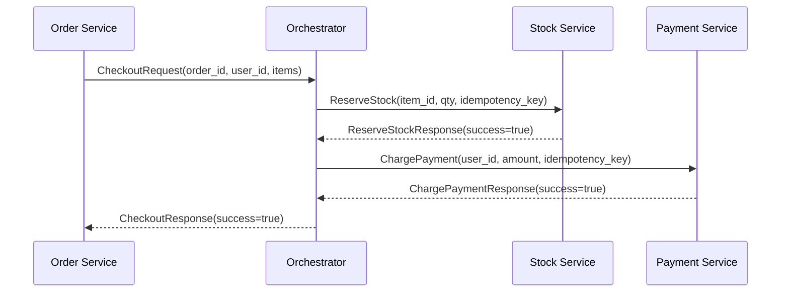
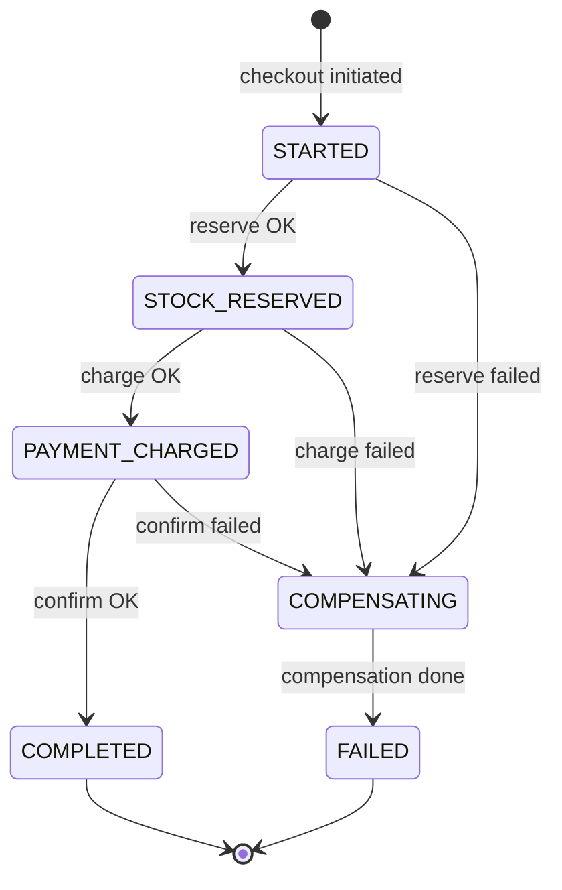
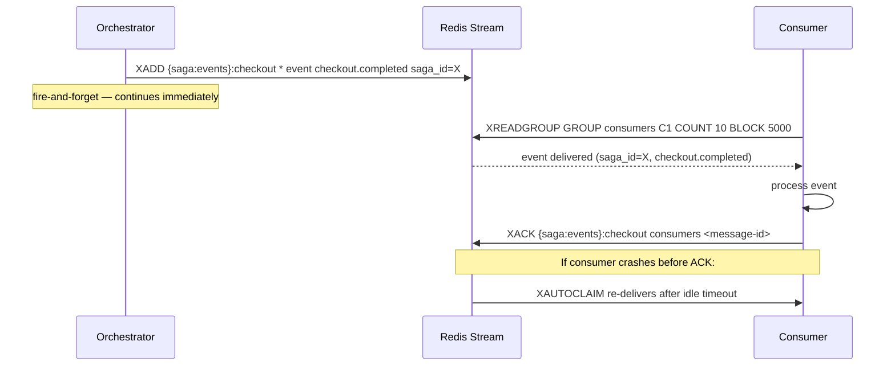

# Architecture Design Document

**Project:** Distributed Checkout System
**Audience:** Team members preparing to explain architectural decisions to instructors
**Purpose:** Each section answers: what was chosen, what alternatives were considered, and why this approach was taken.

---

## 1. System Overview

The distributed checkout system processes e-commerce checkouts across three domain services — Order, Stock, and Payment — coordinated by a dedicated SAGA orchestrator. An nginx gateway routes external HTTP traffic to domain services. Inter-service orchestration uses gRPC. SAGA state is persisted in per-domain Redis Clusters so the system survives container crashes mid-transaction.

```mermaid
graph LR
    Client([Client])

    subgraph Gateway
        GW[nginx :8000]
    end

    subgraph Domain Services
        ORDER[Order Service\n:5000 HTTP\n:50053 gRPC]
        STOCK[Stock Service\n:5000 HTTP\n:50051 gRPC]
        PAYMENT[Payment Service\n:5000 HTTP\n:50052 gRPC]
    end

    subgraph Orchestration
        ORCH[Orchestrator\n:5000 HTTP\n:50053 gRPC]
        STREAMS[(Redis Streams\n{saga:events})]
    end

    subgraph Redis Clusters
        ORDER_DB[(Order Redis Cluster\n{item:} hash tags)]
        STOCK_DB[(Stock Redis Cluster\n{item:} hash tags)]
        PAY_DB[(Payment+Orch Redis Cluster\n{user:} {saga:} hash tags)]
    end

    Client --> GW
    GW --> ORDER
    GW --> STOCK
    GW --> PAYMENT

    ORDER -->|gRPC CheckoutRequest| ORCH
    ORCH -->|gRPC ReserveStock| STOCK
    ORCH -->|gRPC ChargePayment| PAYMENT
    ORCH -->|XADD events| STREAMS

    ORDER --> ORDER_DB
    STOCK --> STOCK_DB
    PAYMENT --> PAY_DB
    ORCH --> PAY_DB
```

---

## 2. Communication: gRPC Design

### What Was Chosen

Proto definitions for two service interfaces:

- **StockService** — `ReserveStock`, `ReleaseStock`, `CheckStock`
- **PaymentService** — `ChargePayment`, `RefundPayment`, `CheckPayment`

Each service runs a **dual-server** configuration: HTTP on port 5000 for external REST API, and gRPC (ports 50051/50052/50053) for internal orchestration. Every mutation RPC includes an `idempotency_key` field defined in the proto schema.

Generated protobuf stubs are committed to the repository with absolute imports. Services run from their own directory, so there is no package installation required.

### Alternatives Considered

| Alternative | Reason Rejected |
|---|---|
| HTTP/REST for inter-service calls | No type safety, no code generation, harder to enforce idempotency contracts in the API definition |
| Message queue (RabbitMQ) for orchestration | Async-only — synchronous checkout steps need response confirmation before proceeding to the next step |
| OpenAPI + JSON | Higher latency due to text serialization, runtime schema validation instead of compile-time |

### Why gRPC

Typed contracts via protobuf enforce interface correctness at code-generation time. The `idempotency_key` field is mandatory in the proto definition — it cannot be omitted by a caller. Binary serialization (protobuf) has lower latency than JSON for synchronous SAGA steps where each RPC result gates the next action. Code generation eliminates manual serialization and deserialization across all three service pairs.



---

## 3. Orchestration: SAGA Pattern

### What Was Chosen

A dedicated SAGA orchestrator service coordinates each checkout as an explicit state machine. SAGA state is persisted in a Redis hash per transaction, so it survives orchestrator restarts.

**State machine:**
- Forward path: `STARTED → STOCK_RESERVED → PAYMENT_CHARGED → COMPLETED`
- Failure path: any forward state → `COMPENSATING → FAILED`

**Compensation order** (reverse of forward steps):
1. Refund payment (if payment was charged)
2. Release stock (if stock was reserved)
3. Mark SAGA `FAILED`

State transitions use a Lua CAS (compare-and-swap) script that validates the expected `from_state` before applying the update — preventing invalid state jumps under concurrent execution. SAGA creation uses `HSETNX` on the `state` field to prevent duplicate SAGAs from concurrent requests.

### Alternatives Considered

| Alternative | Reason Rejected |
|---|---|
| Choreography (no orchestrator) | Each service reacts to events independently — no single owner to detect stuck transactions or drive recovery. Crash-recovery logic would need to be replicated in every service. |
| Two-Phase Commit (2PC) | Redis does not support XA transactions. Even with XA-capable stores, 2PC blocks all participants when the coordinator crashes — the opposite of what we need. |
| Saga without explicit state (in-memory only) | SAGA state lost on orchestrator restart. Would leave stock reserved and payment charged with no owner to compensate. |

### Why SAGA Orchestrator

Single ownership: each SAGA has exactly one owner (the orchestrator). On restart, the orchestrator scans for non-terminal SAGAs and drives them to completion or compensation — no coordination between replicas needed. Idempotent service operations (via Lua caching in stock/payment services) make replay safe at any SAGA step. The explicit state machine makes all valid transitions visible and enforces them atomically. Compensation is guaranteed — retried with backoff until success.



---

## 4. Event-Driven: Redis Streams

### What Was Chosen

SAGA lifecycle events are published to a Redis Stream after each state transition:

- `checkout.started`, `stock.reserved`, `payment.charged`, `checkout.completed`, `compensation.triggered`

Consumer groups with `XREADGROUP` provide at-least-once delivery. `XAUTOCLAIM` (Redis 6.2+) automatically reclaims idle messages from crashed consumers, re-delivering them to healthy consumers. Messages exceeding the max delivery attempts are moved to a dead-letter stream (`{saga:events}:dead-letters`).

Event publishing is **fire-and-forget** — `publish_event()` never raises an exception. On Redis failure, the event is dropped and counted; the checkout transaction continues unaffected.

**Stream names:**
- `{saga:events}:checkout` — primary event stream
- `{saga:events}:dead-letters` — poison messages

The `{saga:events}` hash tag co-locates both streams on the same Redis Cluster slot, enabling atomic Lua operations across streams if needed.

### Alternatives Considered

| Alternative | Reason Rejected |
|---|---|
| Apache Kafka | Industry standard for event streaming, but requires separate broker infrastructure (brokers + ZooKeeper/KRaft). Significantly increases CPU/memory footprint beyond the 20-CPU budget constraint. |
| RabbitMQ | Mature message broker with consumer group semantics, but adds another service to manage. Redis Streams provides equivalent semantics natively using existing infrastructure. |
| Database polling (outbox pattern) | Simpler durability guarantee, but higher latency and load on the database. Redis Streams are purpose-built for this use case. |

### Why Redis Streams

The same Redis infrastructure is already deployed for SAGA state and idempotency storage — no additional services required. Built-in consumer groups with acknowledgment semantics match the at-least-once delivery requirement. `XAUTOCLAIM` handles consumer crashes without manual intervention. Fits within the 20-CPU budget. The fire-and-forget publishing pattern means a Redis outage drops events (logged and counted) but never blocks or fails checkout transactions — events are observability artifacts, not part of the consistency guarantee.



---

## 5. Fault Tolerance Strategy

### What Was Chosen

Three independent fault tolerance layers:

**Layer 1 — Circuit Breakers**
Independent per-service circuit breakers protect the orchestrator from cascading failures. Each breaker (Stock, Payment) has `failure_threshold=5` and `recovery_timeout=30s`. An open breaker means the service is confirmed down — further calls return `CircuitBreakerError` immediately without attempting the RPC. Compensation is triggered immediately on `CircuitBreakerError`. The Stock breaker and Payment breaker are independent: a Stock outage does not affect the Payment breaker state.

**Layer 2 — Startup SAGA Recovery**
On orchestrator startup, a recovery scanner queries Redis for all non-terminal SAGAs (`STARTED`, `STOCK_RESERVED`, `PAYMENT_CHARGED`, `COMPENSATING`) older than `STALENESS_THRESHOLD_SECONDS` (default: 300 seconds, env-var configurable). Each stale SAGA is driven forward using the original idempotency keys (safe to replay) or to compensation. The gRPC server does not begin accepting requests until recovery completes.

**Layer 3 — Container Self-Healing**
`restart: always` on all nine containers ensures crashed containers restart automatically via Docker daemon. Combined with RedisCluster retry configuration, services reconnect to Redis automatically after restart.

### Alternatives Considered

| Alternative | Reason Rejected |
|---|---|
| No recovery scanner (rely on timeouts) | SAGAs stuck in partial state would never resolve. A crashed orchestrator mid-charge leaves stock reserved and the user's account debited with no compensation path. Violates the no-lost-money requirement. |
| Distributed locking (Redlock) for SAGA coordination | Known edge cases with clock skew and split-brain. Idempotency keys + CAS state transitions provide the same safety guarantee without the complexity. |
| Retry circuit-breaker-open calls | Wastes time when a service is genuinely down. Retrying blocks the orchestrator and delays compensation for other transactions. Fail fast and compensate is the correct response. |
| Multiple orchestrator replicas | Would require distributed locking to prevent two replicas from recovering the same SAGA concurrently — adding complexity and known failure modes. Single replica with `restart: always` is simpler and sufficient. |

### Why This Approach

The orchestrator is the single owner of each SAGA, so no inter-replica coordination is needed for recovery. Idempotent forward replay (using the original idempotency keys) makes the recovery scanner safe regardless of how far a SAGA progressed. Circuit breakers contain cascade failures — a down Stock service is detected after 5 failures and subsequent checkouts fail fast, allowing compensation to proceed immediately rather than waiting for gRPC timeouts. Together, these three layers guarantee eventual consistency: after recovery, every checkout is either fully completed or fully compensated.

---

## 6. Infrastructure: Redis Cluster + Kubernetes

### What Was Chosen

**Redis Cluster**

Three independent Redis Clusters, one per domain:

- **Order Cluster** — order data, `{item:}` hash tags
- **Stock Cluster** — inventory data, `{item:}` hash tags
- **Payment + Orchestrator Cluster** — user balances and SAGA state, `{user:}` and `{saga:}` hash tags

Each cluster runs 3 primary + 3 replica nodes. AOF persistence enabled. `noeviction` policy ensures no silent data loss under memory pressure. Hash tags (`{item:}`, `{user:}`, `{saga:}`) guarantee that related keys hash to the same cluster slot, which is required for Lua scripts that operate on multiple keys atomically.

The orchestrator shares the Payment Cluster (not a fourth cluster) — `{saga:}` hash tags isolate SAGA keys from `{user:}` payment keys.

**Kubernetes**

- Horizontal Pod Autoscaler (HPA) scales Order, Stock, and Payment deployments when CPU utilization exceeds 70%
- Orchestrator runs as a single replica to avoid split-brain for SAGA ownership
- Bitnami `redis-cluster` Helm charts for Redis Cluster deployment
- Total resource budget: 20 CPUs across all pods

### Alternatives Considered

| Alternative | Reason Rejected |
|---|---|
| Single shared Redis instance | No fault isolation — a Stock traffic spike affects Payment latency. No automatic failover on primary failure. |
| Redis Sentinel (primary-replica without sharding) | Provides automatic failover but not horizontal sharding. Sufficient for this scale, but Redis Cluster provides both failover and sharding with the same operational model. |
| Multiple orchestrator replicas with distributed locking | Adds Redlock complexity and known split-brain edge cases. Single replica + `restart: always` is simpler and correct for this scale. |
| Managed cloud Redis (ElastiCache, Cloud Memorystore) | Increases cost and vendor dependency. In-cluster Redis with Helm charts matches the Kubernetes deployment model. |

### Why This Approach

Per-domain Redis Clusters provide **fault isolation** — a Stock Redis failure (primary and all replicas lost) does not affect Payment or SAGA state. Automatic failover via Redis Cluster promotion means no manual intervention is needed when a primary node fails. HPA handles traffic spikes within the 20-CPU budget by scaling domain services horizontally. Single orchestrator replica eliminates split-brain for SAGA ownership. Hash tags are the Redis Cluster mechanism for guaranteeing multi-key atomicity within Lua scripts — without them, a Lua script touching `{item:X}:stock` and `{item:X}:reserved` could span two different shards and fail.

```mermaid
graph TD
    subgraph Order Redis Cluster
        OP1[Primary 1\n{item:} slot range A]
        OP2[Primary 2\n{item:} slot range B]
        OP3[Primary 3\n{item:} slot range C]
        OR1[Replica 1] -.->|replicates| OP1
        OR2[Replica 2] -.->|replicates| OP2
        OR3[Replica 3] -.->|replicates| OP3
    end

    subgraph Stock Redis Cluster
        SP1[Primary 1\n{item:} slot range A]
        SP2[Primary 2\n{item:} slot range B]
        SP3[Primary 3\n{item:} slot range C]
        SR1[Replica 1] -.->|replicates| SP1
        SR2[Replica 2] -.->|replicates| SP2
        SR3[Replica 3] -.->|replicates| SP3
    end

    subgraph Payment and Orchestrator Redis Cluster
        PP1[Primary 1\n{user:} {saga:} range A]
        PP2[Primary 2\n{user:} {saga:} range B]
        PP3[Primary 3\n{user:} {saga:} range C]
        PR1[Replica 1] -.->|replicates| PP1
        PR2[Replica 2] -.->|replicates| PP2
        PR3[Replica 3] -.->|replicates| PP3
    end

    ORDER_SVC[Order Service] --> Order Redis Cluster
    STOCK_SVC[Stock Service] --> Stock Redis Cluster
    PAY_SVC[Payment Service] --> Payment and Orchestrator Redis Cluster
    ORCH_SVC[Orchestrator] --> Payment and Orchestrator Redis Cluster
```

---

## Summary: Decision Rationale at a Glance

| Decision | Chosen | Key Reason |
|---|---|---|
| Inter-service communication | gRPC + protobuf | Typed contracts, mandatory idempotency_key, code generation |
| Transaction coordination | SAGA orchestrator | Single owner for crash recovery, explicit state machine |
| Event streaming | Redis Streams | Same infrastructure, consumer groups, fits CPU budget |
| Fault containment | Circuit breakers (per service) | Independent failure domains, fail fast then compensate |
| Crash recovery | Startup SAGA scanner | Safe replay via idempotency keys, blocks until resolved |
| Data storage | Per-domain Redis Clusters | Fault isolation, automatic failover, hash tag atomicity |
| Scaling | HPA + single orchestrator replica | Horizontal scaling for stateless services, no split-brain for SAGA |
